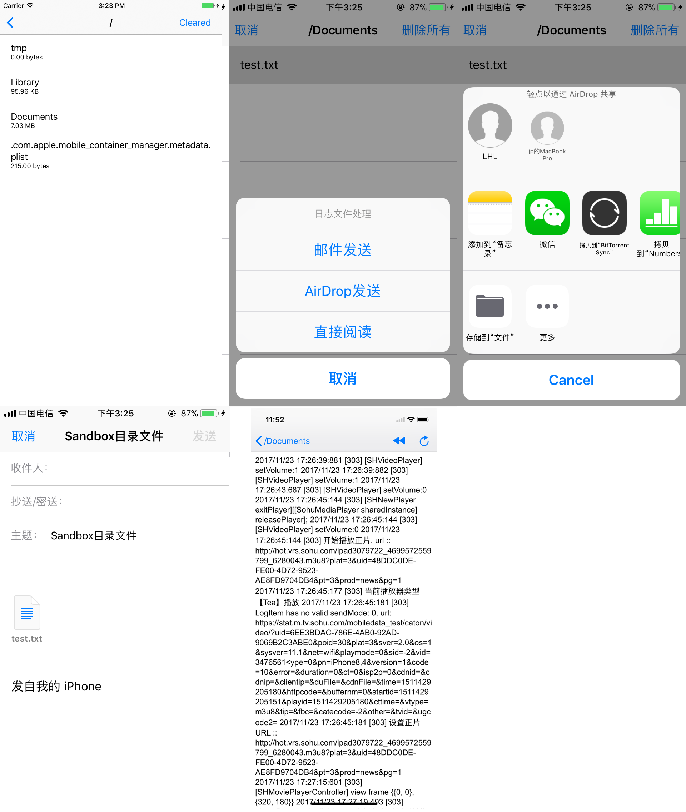

# SendSandBoxFileSwift

iOS8沙盒机制更新后无法查本地文件，给开发带来困扰。使用本库可以把沙盒中文件通过AirDrop、QQ、邮件发送出来，支持多选文件、发文件夹。


```
pod 'SendSandBoxFileSwift'
pod install
```

直接使用
```
let fileListVC =  FileListTableViewController();
self.navigationController?.pushViewController(fileListVC, animated: true);
```

指定特定文件路径和默认邮箱

```
let fileListVC =  FileListTableViewController();
fileListVC.defaultMail = "test1@gmail.com, test2@gmail.com, test3@gmail.com,"
let documentPath =  NSSearchPathForDirectoriesInDomains(FileManager.SearchPathDirectory.documentDirectory, FileManager.SearchPathDomainMask.userDomainMask, true).first;
fileListVC.directoryStr = documentPath;
self.present(fileListVC, animated: true) {
NSLog("present vc");
};

```

效果图：

